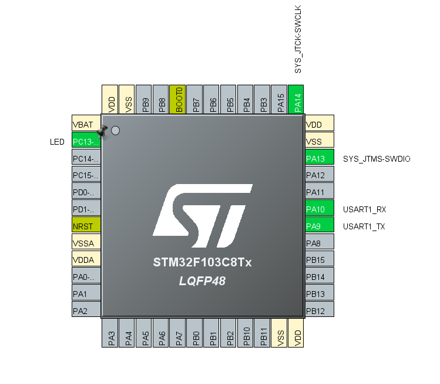
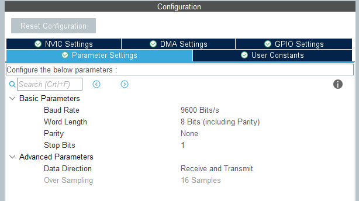
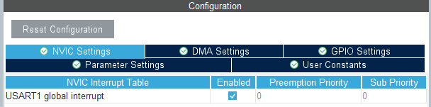

# overview

Features

- Easy Usage
- Stable
- Machine State
- Connect, Publish, Subscribe, Receive

## Pins



## UART

Buad Rate  
  

Interrupt  


## How to Use

First, add this function in RX CallBack
```c
void HAL_UART_RxCpltCallback(UART_HandleTypeDef *huart) {
    if(huart->Instance == USART1){
    	M_SIM800_RXCallBack();
    }
}
```
then free to go!
(recommended: machine state in example file)

## Functions

**Sim800**
```c
void M_SIM800_RXCallBack(void);
void M_SIM800_incomePacket(void);

bool M_SIM800_sendCommand(char *command, char *answer, uint16_t delay);
bool M_SIM800_sendData(uint8_t *data, int data_len);

bool M_SIM800_init(void);
bool M_SIM800_connect(char *APN, char *APN_user, char *APN_pass, char *host, uint16_t port);

```

**MQTT**
```c
bool M_MQTT_connect(char *username, char *password, char *clientid, unsigned short keep_alive_interval, uint8_t clean_session);
bool M_MQTT_publish(char *topic, char *payload, int packetid, int QoS);
bool M_MQTT_subscribe(char *topic, int QoS);
bool M_MQTT_pingReq(void);
```